# ANeuMF
NeuMF with attention mechanism.

### attention 机制

hard attention

hard attention会专注于很小的区域

soft attention

soft attention的注意力相对发散

传统的Attention：`global-attention`/`local-attention`(`soft-attention`)

`hard-attention`据说在NLP效果不好，在图像领域用的比较多

> RNN无法很好地学习到全局的结构信息，因为它本质是一个马尔科夫决策过程。
CNN方便并行，而且容易捕捉到一些全局的结构信息，笔者本身是比较偏爱CNN的，在目前的工作或竞赛模型中，我都已经尽量用CNN来代替已有的RNN模型了，并形成了自己的一套使用经验，这部分我们以后再谈。

> 纯Attention！单靠注意力就可以！RNN要逐步递归才能获得全局信息，因此一般要双向RNN才比较好；CNN事实上只能获取局部信息，是通过层叠来增大感受野；Attention的思路最为粗暴，它一步到位获取了全局信息！

> Attention层的好处是能够一步到位捕捉到全局的联系，因为它直接把序列两两比较（代价是计算量变为𝒪(n2)，当然由于是纯矩阵运算，这个计算量相当也不是很严重）；相比之下，RNN需要一步步递推才能捕捉到，而CNN则需要通过层叠来扩大感受野，这是Attention层的明显优势。

> Self Attention与传统的Attention机制非常的不同：传统的Attention是基于source端和target端的隐变量（hidden state）计算Attention的，得到的结果是源端的每个词与目标端每个词之间的依赖关系。但Self Attention不同，它分别在source端和target端进行，仅与source input或者target input自身相关的Self Attention，捕捉source端或target端自身的词与词之间的依赖关系；然后再把source端的得到的self Attention加入到target端得到的Attention中，捕捉source端和target端词与词之间的依赖关系。因此，self Attention Attention比传统的Attention mechanism效果要好，主要原因之一是，传统的Attention机制忽略了源端或目标端句子中词与词之间的依赖关系，相对比，self Attention可以不仅可以得到源端与目标端词与词之间的依赖关系，同时还可以有效获取源端或目标端自身词与词之间的依赖关系

|          | epochs | batch_size |       layers       | atten_size | data_set  | num_factors |   HR   |  NDCG  |
| :------: | :----: | :--------: | :----------------: | :--------: | :-------: | :---------: | :----: | :----: |
|  1.GMF   |  100   |    4096    |         -          |     -      |   ml-1m   |      8      | 0.6460 | 0.3661 |
|  2.GMF   |  100   |    4096    |         -          |     -      |   ml-1m   |     16      | 0.6884 | 0.4071 |
|  3.GMF   |  100   |    4096    |         -          |     -      |   ml-1m   |     32      | 0.6970 | 0.4173 |
|  4.GMF   |  100   |    4096    |         -          |     -      |   ml-1m   |     64      | 0.6917 | 0.4140 |
|  5.MLP   |  100   |    4096    |  [32, 32, 16, 8]   |     -      |   ml-1m   |      8      | 0.6589 | 0.3824 |
|  6.MLP   |   40   |    4096    |  [64, 64, 32, 16]  |     -      |   ml-1m   |     16      | 0.6737 | 0.3970 |
|  7.MLP   |   40   |    4096    | [128, 128, 64, 32] |     -      |   ml-1m   |     32      | 0.6844 | 0.4038 |
|  8.MLP   |   40   |    4096    |  [256,256,128,64]  |     -      |   ml-1m   |     64      | 0.6874 | 0.4107 |
|  9.GMF   |  100   |    4096    |         -          |     -      | pinterest |      8      | 0.8672 | 0.5430 |
|  10.GMF  |  100   |    4096    |         -          |     -      | pinterest |     16      | 0.8580 | 0.5285 |
|  11.GMF  |  100   |    4096    |         -          |     -      | pinterest |     32      | 0.8553 | 0.5298 |
|  12.GMF  |  100   |    4096    |         -          |     -      | pinterest |     64      | 0.8553 | 0.5294 |
|  13.MLP  |   40   |    4096    |    [32,32,16,8]    |     -      | pinterest |      8      | 0.8432 | 0.5142 |
|  14.MLP  |   40   |    4096    |  [64, 64, 32, 16]  |     -      | pinterest |     16      | 0.8562 | 0.5275 |
|  15.MLP  |   40   |    4096    |  [128,128,64,32]   |     -      | pinterest |     32      | 0.8565 | 0.5265 |
|  16.MLP  |   40   |    4096    |  [256,256,128,64]  |     -      | pinterest |     64      | 0.8611 | 0.5345 |
| 17.NeuMF |  100   |    4096    |    [32,32,16,8]    |     -      |   ml-1m   |    32/8     | 0.6921 | 0.4141 |
| 18.NeuMF |  100   |    4096    |   [64,64,32,16]    |     -      |   ml-1m   |    32/16    | 0.6899 | 0.4122 |
| 19.NeuMF |  100   |    4096    |  [128,128,64,32]   |     -      |   ml-1m   |    32/32    | 0.6896 | 0.4147 |
| 20.NeuMF |  100   |    4096    |  [256,256,128,64]  |     -      |   ml-1m   |    32/64    | 0.6916 | 0.4101 |
| 21.NeuMF |   25   |    4096    |    [32,32,16,8]    |     -      | pinterest |    32/8     | 0.8400 | 0.5177 |
| 22.NeuMF |   25   |    4096    |   [64,64,32,16]    |     -      | pinterest |    32/16    |        |        |
| 23.NeuMF |   25   |    4096    |  [128,128,64,32]   |     -      | pinterest |    32/32    | 0.8395 | 0.5189 |
| 24.NeuMF |   25   |    4096    |  [256,256,128,64]  |     -      | pinterest |    32/64    |        |        |

---

首先，深度学习模型很大程度上来自不同基础模块的组合，通过不同方式组合不同模块，构建不同的模型。最经典的就是Google的`Wide&Deep`模型，结合深度模块DNN和线性模块LR，让模型同时拥有记忆性和泛化性。

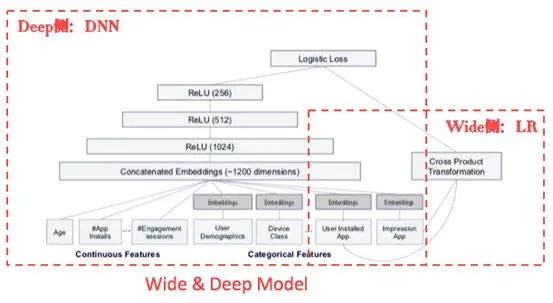

这是Google提出的非常经典的网络结构，离散特征经过Embedding和连续特征一起输入到DNN侧，Wide侧是一些人工交叉（如用笛卡尔积）特征，主要交叉的是id类特征，来学习特征间的共现。主要公式如下:

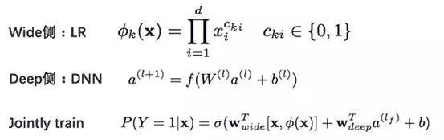

Wide侧LR模型的记忆性很强，比如用户买了一本科幻书，下一次再出现这样的组合，模型就会记住判断正确。但若此时来了一本科学书，LR模型不一定能分对，所以需要Deep侧DNN模型的补充。

Deep侧DNN模型通过Embedding层挖掘特征间的语义相关性，比如上个例子中，通过Embedding模型可以学到“科学”和“科幻”是相似的，从而也能推出用户也可能喜欢科学书。这样，通过DNN和LR模型的结合，`Wide&Deep`模型有很好的记忆性和泛化性。**这是目前猜你喜欢线上在用的模型。**

**PNN**

`PNN`的思想来自对MLP学习的交叉特征的补充，作者认为MLP不能很好地学出特征间的交叉关系，所以提出了一种`product layer`的思想，也就是基于乘法的运算强行显式地进行二阶特征交叉，结构如下：

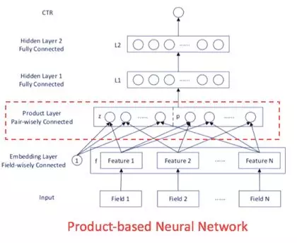

从结构图中可以看出，`product layer`可以分成z和p两部分，线性部分直接从Embedding结果得到，非线性部分也就是乘积部分，这里的乘积有两种选择，内积或外积。

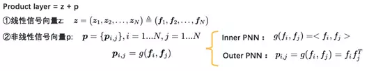

但是这种结构的受限之处在于，它要求输入特征Embedding到相等的维度，因为维度相同才能做乘积运算。

**DeepFM**

它的结构很像`wide&deep`与`PNN`的结合，它是把`wide&deep`中wide侧的LR换成了乘积结构FM，通过FM和DNN分别提取低阶和高阶特征。而且这两部分共享Embedding输入。结构如下图：

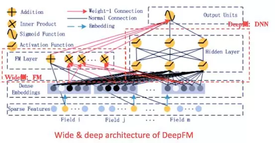

FM部分是一个因子分解机。因为引入了隐变量的原因，对于几乎不出现或很少出现的隐变量，FM也能很好的学习。FM的公式如下：

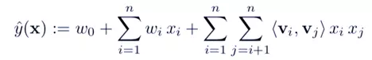

而且在FM的文章中，作者还给出了求解交叉项的化简公式：

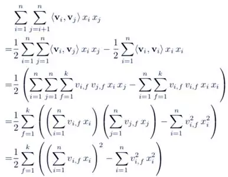

跟PNN一样，因为FM强制特征间二阶交叉，所以需要把特征Embedding到相等长度的维度，而且DeepFM结构两边的输入是共享的，不需要像`Wide&Deep`一样人工给LR模型构造交叉特征，节省了人力。但在实际应用中，不同特征的维度相差很大，比如性别只有3维（男、女、未知），而id类特征多达上亿维，不可能都Embedding到相同的长度。可以通过`Group product`的方式分组Embedding。

**Wide&Resnet**

想法来源于对`Wide&Deep`模型的改进，把原来`Wide&Deep`结构中DNN部分改成了一个类似Resnet那样的skip connection的结构，也就是信号分成两路，一路还是经过两个relu层，另一路直接到第二层relu，形成类似残差网络的结构，这样做的好处是，可以把不同层级的特征进行组合，丰富特征的信息量。模型对比：

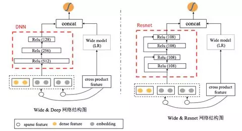

实验发现，单纯从DNN改到Resnet的结构并没有多少作用，但是在Resnet中加入batchnormalization，之后，网络的表达能力得到了很大的提高。

实验表明，BN对模型的稳定性起到了很明显的效果。

一些调参的经验：

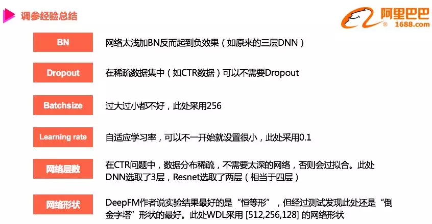

---

互联网数据的特点，首要特点就是规模大，维度高，样本多，另外互联网数据内部也有丰富的内在的关系。

CTR `Click-Through-Rate`即点击通过率。衡量互联网广告效果的一项重要指标。

深度学习在图像处理、自然语言理解和语音识别等领域取得了突破性进展，已经成为人工智能的一个热点。深度学习与推荐系统的结合，能够为推荐系统带来新的机遇。深度学习的强大表征能力使得一方面可以学习用户和产品的深层非线性表征，另一方面非结构化数据处理成为可能。

发挥深度学习最大的作用就一定要端到端学习

> 这里也包含了我们对深度学习的认知 —— 要发挥出深度学习最大的作用就一定要端到端学习。这里有个反证：我们曾多次尝试很多非端到端的方法，效果不是很好。例如：图像，最简单的方法就是把图像抽出一些特征塞到点击率或转化率的模型里。另外，如果每抽一次特征再加一个模型的方法能够运行，深度学习就不会在这几年才会如此蓬勃发展。原来我都可以把一个浅层模型的输出，作为下一个浅层模型的输入，用浅层模型一步一步加工得更好，最后变成了一个深层的计算。实际上，这些模型的输出必须根据后面的模型进行协同，而不是直接对最终目标进行拟合，所以端到端非常重要。这是对框架的挑战也是机会。

推荐系统是迄今为止商业化最为成功的技术之一。推荐系统的基本原理是基于算法和大数据猜测用户喜好，为用户推荐他们感兴趣的物品。推荐系统的应用场景非常广泛，从新闻推荐，音乐推荐，到电影推荐无所不包。

推荐系统发展至今已有相当长的历史了，形成了一个庞大的算法和研发体系。推荐系统领域最早的算法是协同过滤算法，现在基本不被各大互联网公司作为线上系统使用，仅作为算法迭代的初始比较标准。

协同过滤包括基于用户的协同过滤（user-based collaborative filtering）和基于物品的协同过滤（item-based collaborative filtering）两种。

- 基于用户的协同过滤：算法思想是计算用户和用户之间的相似性，然后将与某个用户最近的物品通过用户相似性加权计算，得分排序后推荐给用户。
- 基于物品的协同过滤：算法思想与此类似，只是首先计算物品和物品的相似性，然后再通过加权排序的方式计算用户的评分，并将得分高的物品推荐给用户。

**矩阵分解模型**

类似SVD分解、LDA分解、ALS等其他的矩阵分解模型将用户对物品的评分矩阵分解为用户-隐变量矩阵和物品-隐变量矩阵，然后通过计算向量乘积完成用户评分矩阵的填充。

因为矩阵分解模型需要计算完整的用户-物品评分矩阵，所以时间复杂度比较高。

混合模型与单一模型相比更具有优势，线性模型与非线性模型的叠加。

近年来，随着深度学习的兴起，推荐系统也受到了人工智能大潮的洗礼。深度学习正在逐步成为推荐系统未来发展的主流趋势。

在过去十年，神经网络的发展已经有了巨大的飞跃。现在它们正被应用于各种各样的应用，并且正在逐渐代替传统的机器学习方法。

> 要说明实验过程中train的负样本是如何选出来的。

推荐系统：推荐技术提供用户对某个目标（兴趣）的偏好程度预测能力，基于偏好预测排序输出用户喜好的目标（兴趣）集合。

压缩网络，深层网络模型和运算量大，训练上是非常困难的，使用起来也是非常昂贵的。通过构建复杂的激活函数来在预测函数中引入高度非线性，以此来取代神经网络的深度优势。简而言之，就是用一个非常复杂的激活函数来开发一个相对较浅的网络。

> 有理论暗示了存在一个复杂的双曲型激活函数，使得任何连续函数都可以通过两个隐藏层的神经网络得到很好的近似。搜索非线性激活函数的优点是激活函数是单变量函数，即使在非参数化设置中也可以有效地完成其优化。

**Attention**

涉及到注意力机制的神经处理，已经在神经科学和计算神经科学中被大量研究了，一个特殊的研究方向是视觉注意力：许多动物集中于视野内的某些部分从而做出合适的反应。这种现象对神经计算有很大影响，比如我们需要选择出最相关的信息片段，而非使用所有的可用信息，其中大部分是对神经反应没有用处的信息。相似的思路（集中于输入的特定部分）已经应用到了深度学习中，例如语音识别、机器翻译、推断、目标识别等。

---

**推荐系统**就是根据用户的历史，社交关系，兴趣点，上下文环境等信息去判断用户当前需要或潜在感兴趣的内容的一类应用。

大数据时代，信息量过载。用户从大量的信息中寻找对自己感兴趣的信息也随之变得困难；而对于信息生产者而言，让自己生产的信息在众多信息中脱颖而出也变得越来越苦难。推荐系统就是在这样的前提下产生的。

推荐系统的主要任务就是联系用户与信息。对于用户而言，推荐系统能够帮助用户找到感兴趣的内容，帮忙进行决策与筛选，发现用户可能喜欢的新事物。对于商家而言，推荐系统可以给用户提供个性化服务，提供用户的信任度和粘性，增加营收，或者精确投放对应的广告，提高收入。

通过一组简单的数据，我们即可了解推荐系统的价值：  

- Netflix: 2/3被观看的电影来自推荐
- Google news: 38%的点击量来自推荐
- Amazon: 35%的销量来自推荐

大数据时代，我们的生活的方方面面都出现了信息过载的问题：电子商务、电影或者视频网站、个性化音乐网络电台、社交网络、个性化阅读、基于位置的服务、个性化邮件、个性化广告.......逛淘宝、订外卖、听网络电台、看剧等等等。推荐系统在你不知不觉中将你感兴趣的内容推送给你，甚至有的时候，推荐系统比你本人更了解你自己。

ctr即广告点击率，在推荐系统中，通常是按照ctr来对召回的内容子集进行排序，然后再结合策略进行内容的分发。

LR的优势在于处理离散化特征，而且模型十分简单，很容易实现分布式计算，LR的缺点也很明显，特征与特征之间在模型中是独立的，对于一些存在交叉可能性的特征，需要进行大量的人工特征工程进行交叉。虽然模型简单了，但是人工的工作却繁重了很多。而且LR需要将特征进行离散化，归一化，在离散化过程中也可能出现边界问题。

GBDT，即梯度提升决策树，是一种表达能力较强的非线性模型。GBDT的优势在于处理连续值特征，比如用户历史点击率，用户历史浏览次数等连续值特征。而且由于树的分裂算法，它具有一定的组合特征的能力，模型的表达能力要比LR强。GBDT对特征的数值线性变化不敏感，它会按照目标函数，自动选择最优的分裂特征和该特征的最优分裂点，而且根据特征的分裂次数，还可以得到一个特征的重要性排序。所以，使用GBDT减少人工特征工程的工作量和进行特征筛选。GBDT善于处理连续值特征，但是推荐系统的绝大多数场景中，出现的都是大规模离散化特征，如果我们需要使用GBDT的话，则需要将很多特征统计成连续值特征（或者embedding），这里可能需要耗费比较多的时间。同时，因为GBDT模型特点，它具有很强的记忆行为，不利于挖掘长尾特征，而且GBDT虽然具备一定的组合特征的能力，但是组合的能力十分有限，远不能与dnn相比。

LR不能自动处理交叉特征。而FM则是在这个基础上改进的。

FM具备处理特征间的二次交叉的能力。

FM的优点相对于LR在于拥有处理二次交叉特征的能力，而且它是可以实现线性的时间复杂度的，模型训练也十分快。

而FFM则是在FM的基础上，考虑了特征交叉的field的特点，但是也导致它没有办法实现线性的时间复杂度，模型训练要比FM慢一个量级，但是效果会比FM来得更好。

GBDT适合处理连续值特征，而LR,FM,FFM更加适合处理离散化特征。GBDT可以做到一定程度的特征组合，而且GBDT的特征组合是多次组合的，不仅仅是FM与FFM这样的二阶组合而已，同时GBDT具备一定的特征选择能力（选择最优的特征进行分裂）。

针对这一现象，facebook提出的解决方案是，先使用GBDT对一些稠密的特征进行特征选择，得到的叶子节点，再拼接离散化特征放进去LR进行训练。简单来说，利用GBDT替代人工实现连续值特征的离散化，而且同时在一定程度组合了特征，可以改善人工离散化中可能出现的边界问题，也减少了人工的工作量。

MLR是阿里团队提出的一种非线性模型，它等价于聚类+LR的形式。相当于将X进行聚类聚成m类，然后每一个聚类单独训练一个LR。MLR相对于LR拥有更好的非线性表达能力，算是LR的一种拓展。但是MLR相对于LR拥有更好的非线性表达能力，算是LR的一种拓展。但是MLR与LR一样，也需要较大的特征工程处理，而且这个模型本身属于非凸模型，需要预训练，可能出现不收敛的情况。

---

DNN篇

多数场景绝大多数特征都是大规模离散化特征，而且交叉类的特征十分重要，如果利用简单的模型（LR），需要做大量的人工特征工程，任务繁重。哪怕是GBDT,FM等具有一定交叉特征能力的模型，也是交叉的能力十分有限，也脱离不了特征工程。

而DNN类的模型拥有很强的模型表达能力，而且其结构也是看上去天然具有特征交叉的能力。利用基于DNN的模型做CTR问题主要有两个优势：模型表达能力强，能够学习出高阶非线性特征。容易扩充其他类别的特征，比如在拥有图片，文字类特征的时候。

DNN模型的主要架构：

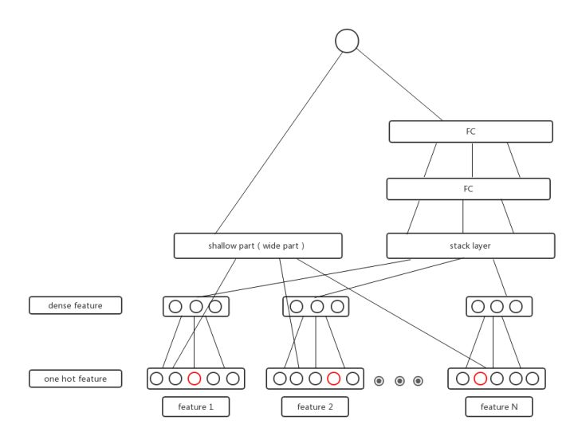

基本上目前已有的DNN模型都是和这个框架类似，只是stack layer的方法不一样，有无shallow part，或者shallow part异同。

- Deep&Wide model

  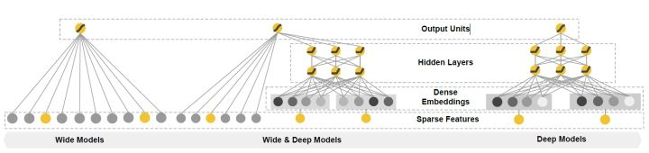

shallow part为：lr，stack layer则为：concatenate （拼接embedding后的向量）

- DeepFM model

  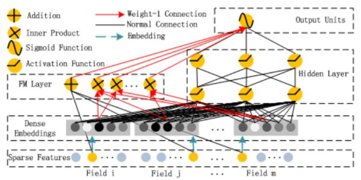

shallow part为fm，而stack layer也是concatenate

- NFM model

  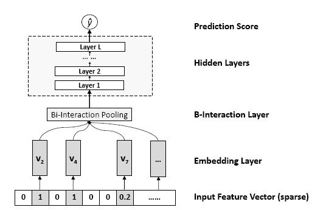

shallow part为lr，而stack layer则为Bi-interaction，实际上就是先做向量的内积（与FM类似，但是没有累加），然后再做累加。

其他模型也是与这些模型类似，其实DNN做ctr问题，关键的部分无非三部分：

- 是否保留浅层模型（存在不保留shallow part的model，如FNN，PNN）
- 如何体现特征交叉性，即stack layer的做法是什么。concatenate/bi-interaction/直接向量加法等
- embedding+fc是标配

---

FM （Factorization Machine）主要是解决数据稀疏的情况下，特征怎样组合的问题。

数据的稀疏性，是我们在实际场景中面临的一个非常常见的问题和挑战。

one-hot编码会导致特征的稀疏和特征空间变大。

对于普通的线性模型，我们都是将特征独立考虑的，并没有考虑到特征之间的相互关系。但实际上，大量特征之间是有关联的。

商品的embedding向量最终的作用，是不同商品在用户兴趣空间中位置表达。

与线性模型相比，FM的模型就多了后面特征组合的部分。

